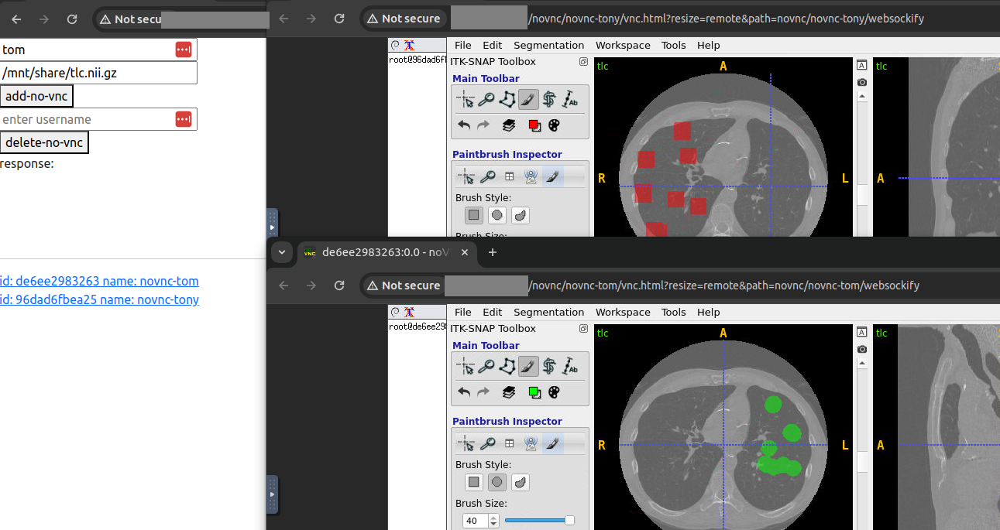

# self-serve-ghetto-app-stream




Above screenshot shows the current state of this 1-day project. Flask app (Left) lets user run or remove containers.  Via http links, user can access individual container via novnc (Middle and Right) in the browser.

tech-stack: novnc,x11vnc,docker,nginx,flask

disclaimer: this is an investigational excercise, a proof-of-concept, a sorta partially working project, you should really try out `Kasm Workspace`, `AWS Appstream` or the likes before venturing to the diy route...

## todos

[x] create/find-existing Dockerfile.novnc for app streamer

    + play 4k youtube video in browser to test frame rate
    + can copy paste, key-combo-shortcuts

    use below for streaming desktop
    https://github.com/linuxserver/docker-baseimage-kasmvnc

[x] above example already shows you how to install shit.

[x] flask/nginx to spin up docker to do reverse proxy

[x] deploy via k8s/swarm

[x] self serve add-novnc


## ref novnc

https://stackoverflow.com/questions/16296753/can-you-run-gui-applications-in-a-linux-docker-container
https://www.server-world.info/en/note?os=Ubuntu_22.04&p=desktop&f=8

https://github.com/ConSol/docker-headless-vnc-container/blob/master/kubernetes/README.md

docker run -p 5901:5901 -p 6901:6901 consol/debian-icewm-vnc # just works, icewm ugly af
no-copy-paste? https://github.com/ConSol/docker-headless-vnc-container/issues/194

https://github.com/kasmtech/noVNC/


## ref reverse proxy

https://serverfault.com/a/708779

docker exec -it ghetto-app-streamer-flask-1 bash
docker exec ghetto-app-streamer-nginx-1 /usr/sbin/nginx -s reload

https://datawookie.dev/blog/2021/08/websockify-novnc-behind-an-nginx-proxy

above not fucking working for me, why...
FFFF F because broswer caches!!!@#!@#!!!

https://fhlipzero.io/blogs/6_noVNC/noVNC.html

https://github.com/novnc/noVNC/issues/1550
https://github.com/novnc/noVNC/wiki/Proxying-with-nginx

```
docker stop $(docker ps -a -q)
docker rm $(docker ps -a -q)
```